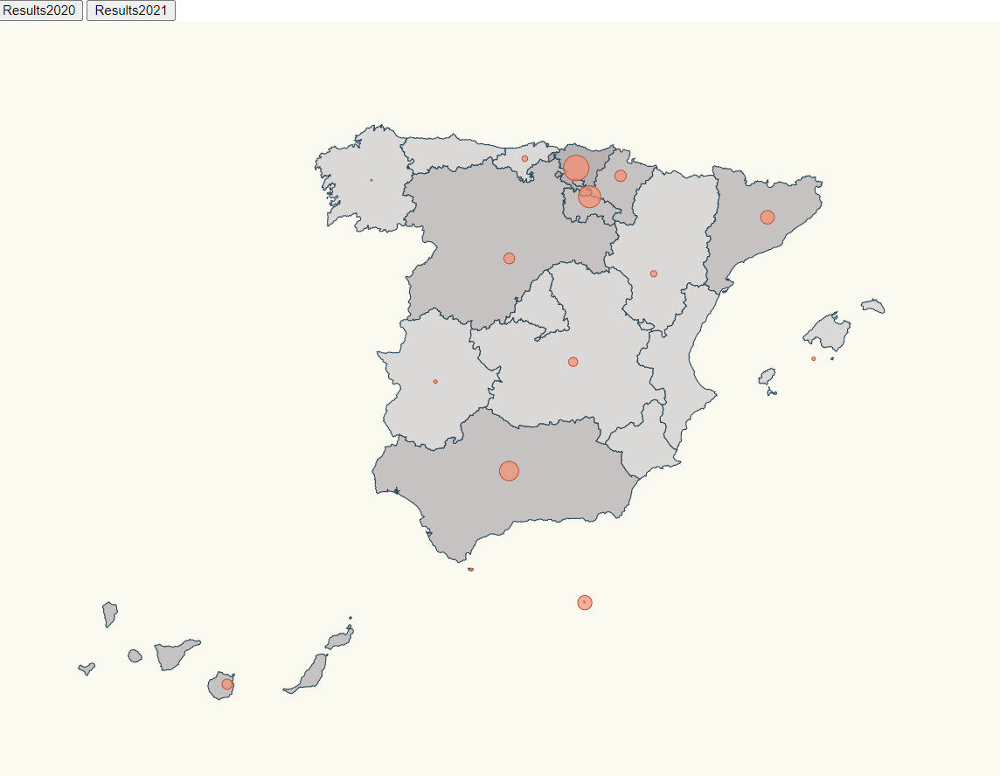
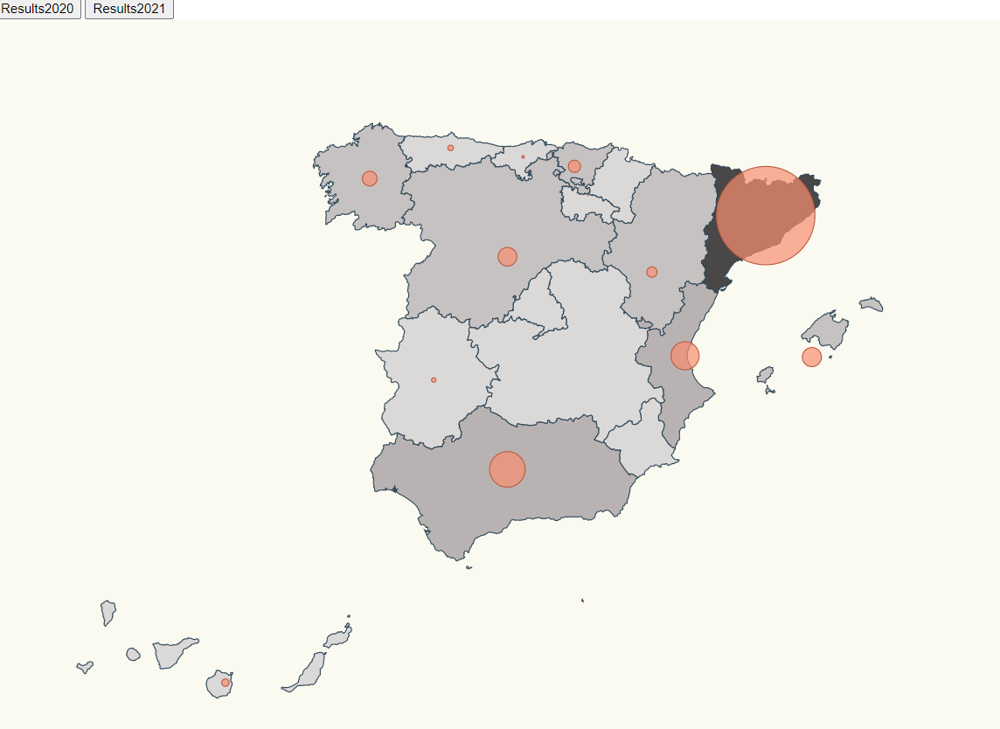

in this exercice we will be able to vizualise the representation of COVID cases in 2020 and 2021 by clickin on the two botton below so as to see the evolucion of the virus cases fron the beginning until today .
the data will be represenced in each automomous comumity by a scale pin radius .






codesandbox: https://codesandbox.io/s/hopeful-ellis-rlczx


# Steps

- We will take as starting example the 1---Mandatory-Excercise  , let's copy the content from that folder and execute npm install.

```bash
npm install
```
 _src/communities.t_
 
 -we added the longitud and latitud of the three missins comumities 
 
```bash
 {
    name: "Navarra",
    long: -1.65,
    lat: 42.816666,
  },
  {
    name: "Melilla",
    long: -2.93848,
    lat: 35.2919,
  },
  {
    name: "Ceuta",
    long: -5.3162,
    lat: 35.8883,
  }
```

  
  _./src/index.html_
  
 -we insert the two buttons stated below in the body funcion 

```bash
<html>
  <head>
    <link rel="stylesheet" type="text/css" href="./map.css" />
    <link rel="stylesheet" type="text/css" href="./base.css" />
  </head>
  <body>
    <div>
      <button id="Results2020">Results2020</button>
      <button id="Results2021">Results2021</button>
    </div>
    <script src="./index.ts"></script>
  </body>
</html>
```
-


_./src/index.ts_


- we creat a fuction that returns the affected cases given the dataset and the comunity


const getAffectedCases = (comunidad: string, data: any[]) => {
    const entry = data.find((item) => item.name === comunidad);  
    return entry ? entry.value : 0;
  };


- we creat a funsion that using the function above returns the scaled max number of affected person

```bash
const calculateBasedOnAffectedCases = (comunidad: string, data: any[]) => {
    const entry = data.find((item) => item.name === comunidad);
    var max = data.reduce((max, item) => (item.value > max ? item.value : max), 0);
    return entry ? (entry.value / max) * 50 : 0;
  };

```

- we creat a function that calculates the radius based on the function above  

```bash
 const calculateRadiusBasedOnAffectedCases = (
    comunidad: string,
    data: any[]
  ) => {
    return calculateBasedOnAffectedCases(comunidad, data);
  };

```

- we creat a function to update the new values of the circle the new radius calculated above  
- colorcommunity and colorCircle are two scale threshold to asigne colors depending of the affected cases.
- assignColor is a a funcion that given the data set and the community asigns the color depending on the number of affected cases 

```bash
  const update = (data: ResultEntry[]) => {
    svg.selectAll("path").remove();
    svg.selectAll("circle").remove();
  const calculateMaxAffected = (data) => {
    return data.reduce(
      (max, item) => (item.value > max ? item.value : max),
      0
    );
  };
  const maxAffected = calculateMaxAffected(data);

  const colorCommunity = d3
    .scaleThreshold<number, string>()
    .domain([0,
       maxAffected * 0.1,
        maxAffected * 0.25,
         maxAffected * 0.5,
          maxAffected * 0.75,
           maxAffected])
    .range([
      "#F0EFEF",
      "#DBD8D8",
      "#C6C2C1",
      "#b8b3b2",
      "#828B9E",
      "##938F8E",
      "#494747",
    ]);
    const colorCircle = d3
    .scaleThreshold<number, string>()
    .domain([0, 50, 100, 1200, 5000, 50000])
    .range([
      "#F6FAFC",
      "#DBEDF6",      
      "#C0E0EF",
      "#a6d3e9",
      "#95BDD1",
      "#40b0e7"
    ]);
    const assignColor = (comunidad: string, dataset: ResultEntry[], circle: boolean) => {
      const entry = dataset.find((item) => item.name === comunidad);
      if (circle){
        return entry ? colorCircle(entry.value) : colorCircle(0);
      }
      return entry ? colorCommunity(entry.value) : colorCommunity(0);
    };
  
    svg
      .selectAll("path")
      .data(geojson["features"])
      .enter()
      .append("path")
      .attr("class", "country")
      .attr("d", geoPath as any)
      .style("fill", function (d: any) {
        return assignColor(d.properties.NAME_1, data, false)
      })
  
    svg
      .selectAll("circle")
      .data(latLongCommunities)
      .enter()
      .append("circle")
      //.transition()
      //.duration(500)
      .attr("class", "affected-marker")
      .attr("fill", (d, i) => {
        return assignColor(d.name, data, true);
      })
      .attr("r", (d) => calculateRadiusBasedOnAffectedCases(d.name, data))
      .attr("cx", (d) => aProjection([d.long, d.lat])[0])
      .attr("cy", (d) => aProjection([d.long, d.lat])[1])    
      .on("mouseover", function (e: any, datum:any) {            
          const coords = { x: e.x, y: e.y };
          div.transition().duration(200).style("opacity", 0.7);
          div
            .html(`<span>${datum.name}: ${getAffectedCases(datum.name, data)}</span>`)
            .style("left", `${coords.x}px`)
            .style("top", `${coords.y - 28}px`);
        })
        .on("mouseout", function (datum) {    
          div.transition().duration(500).style("opacity", 0);
        });


  };

```


- we creat 2  function each with the click event to show each the results   

```bash
  const update = (data: ResultEntry[]) => {
    svg.selectAll("circle").remove();
    svg
      .selectAll("circle")
      .data(latLongCommunities)
      .enter()
      .append("circle")
      .attr("class", "affected-marker")
      .attr("r", (d) => calculateRadiusBasedOnAffectedCases(d.name, data))
      .attr("cx", (d) => aProjection([d.long, d.lat])[0])
      .attr("cy", (d) => aProjection([d.long, d.lat])[1])      
  };

```
_./src/maps .ts_

.country {
  stroke-width: 1;
  stroke: #2f4858;
  fill: #008c86;
}
.affected-marker {
  stroke-width: 1;
  stroke: #bc5b40;
  fill: #f88f70;
  fill-opacity: 0.7;
} 

_./src/stats.ts_
we add the data for the 3 missing comunities fron march 2020
```bash
{
    name: "Navarra",
    value: 20,
  },
    {
    name: "Melilla",
    value: 25,
  },
  {
    name: "Ceuta",
    value: 5,
  }
  
```
we add the data of july 16 retrived from https://www.eldiario.es/sociedad/mapa-datos-coronavirus-espana-comunidades-autonomas-julio-16_1_1039633.html

```bash

export const statshoy : ResultEntry[] = [
  {
    name: "Madrid",
    value: 4067,
  },
  {
    name: "La Rioja",
    value: 89,
  },
  {
    name: "Andalucía",
    value: 3485,
  },
  {
    name: "Cataluña",
    value: 9635,
  },
  {
    name: "Valencia",
    value: 2754,
  },
  {
    name: "Murcia",
    value: 457,
  },
  {
    name: "Extremadura",
    value: 432,
  },
  {
    name: "Castilla La Mancha",
    value: 572,
  },
  {
    name: "País Vasco",
    value: 1191,
  },
  {
    name: "Cantabria",
    value: 252,
  },
  {
    name: "Asturias",
    value: 539,
  },
  {
    name: "Galicia",
    value: 1438,
  },
  {
    name: "Aragón",
    value: 1012,
  },
  {
    name: "Castilla y León",
    value: 1828,
  },
  {
    name: "Islas Canarias",
    value: 732,
  },
  {
    name: "Islas Baleares",
    value: 1873,
  },
  {
    name: "Navarra",
    value: 675,
  },
  {
    name: "Melilla",
    value: 10,
  },
  {
    name: "Ceuta",
    value: 19,
  }
  
];

```

- then  we need to run 

```bash
npm start 
```


